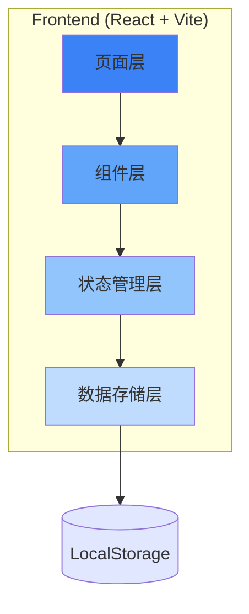
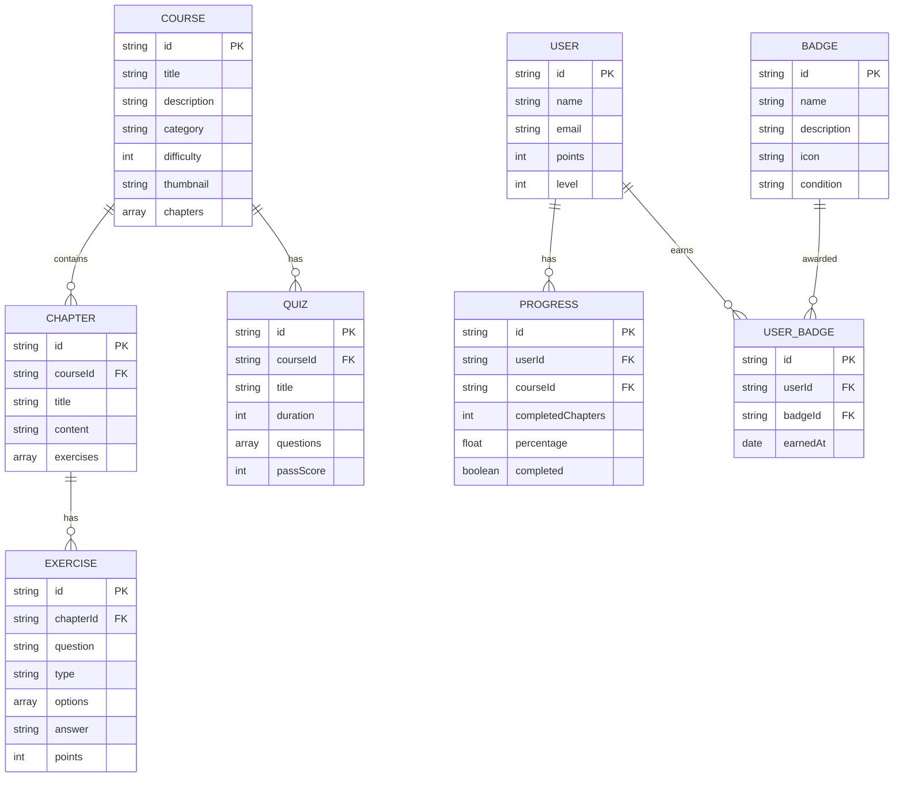

# 商务数据分析在线教育平台 - 技术架构文档

## 1. 架构设计

本项目采用纯前端架构，部署到 Cloudflare Pages，所有数据存储在浏览器本地（localStorage），无需后端服务。



## 2. 技术选型

- **前端框架**: React@18 + TypeScript
- **构建工具**: Vite
- **样式方案**: Tailwind CSS
- **状态管理**: Zustand
- **路由管理**: React Router DOM
- **代码编辑器**: CodeMirror
- **图标库**: Lucide React
- **部署平台**: Cloudflare Pages

## 3. 路由定义

| 路由 | 页面名称 | 用途 |
|------|---------|------|
| / | 首页 | 平台介绍、课程导航、推荐内容 |
| /courses | 课程中心 | 课程列表、搜索筛选 |
| /courses/:id | 课程详情 | 课程介绍、学习大纲 |
| /courses/:id/learn | 学习页面 | 课程内容学习、互动练习 |
| /practice | 练习模块 | 练习题列表、答题界面 |
| /quiz | 测评系统 | 测试列表、考试界面 |
| /achievements | 成就中心 | 徽章展示、积分排行 |

## 4. 数据模型

### 4.1 数据模型定义



### 4.2 数据结构定义（TypeScript）

```typescript
// 用户相关
interface User {
  id: string;
  name: string;
  email: string;
  points: number;
  level: number;
}

// 课程相关
interface Course {
  id: string;
  title: string;
  description: string;
  category: string;
  difficulty: 1 | 2 | 3 | 4 | 5;
  thumbnail: string;
  chapters: Chapter[];
}

interface Chapter {
  id: string;
  title: string;
  content: string;
  exercises: Exercise[];
}

// 练习相关
interface Exercise {
  id: string;
  question: string;
  type: 'choice' | 'code' | 'truefalse';
  options?: string[];
  answer: string;
  points: number;
}

// 测评相关
interface Quiz {
  id: string;
  courseId: string;
  title: string;
  duration: number; // 分钟
  questions: QuizQuestion[];
  passScore: number;
}

interface QuizQuestion {
  id: string;
  question: string;
  type: 'choice' | 'code';
  options?: string[];
  answer: string;
  points: number;
}

// 学习进度
interface Progress {
  id: string;
  userId: string;
  courseId: string;
  completedChapters: string[];
  percentage: number;
  completed: boolean;
}

// 成就相关
interface Badge {
  id: string;
  name: string;
  description: string;
  icon: string;
  condition: string;
}

interface UserBadge {
  id: string;
  userId: string;
  badgeId: string;
  earnedAt: string;
}
```

### 4.3 初始化数据

项目将包含以下初始数据：

**课程体系（6门核心课程）**：
1. 数据分析基础
2. Excel 商务应用
3. Python 数据分析
4. 数据可视化
5. 商业智能与报表
6. 数据分析实战项目

**徽章系统（10+ 成就徽章）**：
- 初学者徽章
- 课程完成者
- 练习达人
- 测评高手
- 连续学习
- 等等

## 5. 状态管理设计

使用 Zustand 管理全局状态：

```typescript
interface AppState {
  // 用户状态
  user: User | null;
  setUser: (user: User) => void;
  
  // 课程状态
  courses: Course[];
  currentCourse: Course | null;
  setCurrentCourse: (course: Course) => void;
  
  // 学习进度
  progress: Progress[];
  updateProgress: (courseId: string, chapterId: string) => void;
  
  // 成就状态
  badges: Badge[];
  userBadges: UserBadge[];
  addPoints: (points: number) => void;
  unlockBadge: (badgeId: string) => void;
}
```

## 6. 项目结构

```
/workspace
├── src/
│   ├── components/       # 可复用组件
│   │   ├── Layout.tsx
│   │   ├── CourseCard.tsx
│   │   ├── Badge.tsx
│   │   └── ...
│   ├── pages/           # 页面组件
│   │   ├── Home.tsx
│   │   ├── Courses.tsx
│   │   ├── CourseDetail.tsx
│   │   ├── Learn.tsx
│   │   ├── Practice.tsx
│   │   ├── Quiz.tsx
│   │   └── Achievements.tsx
│   ├── hooks/           # 自定义 Hooks
│   │   └── useStore.ts
│   ├── utils/           # 工具函数
│   │   ├── data.ts      # 初始数据
│   │   └── storage.ts   # 本地存储
│   ├── App.tsx
│   ├── main.tsx
│   └── index.css
├── public/
├── package.json
├── vite.config.ts
├── tailwind.config.js
├── tsconfig.json
└── README.md
```

## 7. Cloudflare Pages 部署配置

1. 构建命令：`npm run build`
2. 输出目录：`dist`
3. 环境变量：无需后端环境变量
4. 路由配置：使用 SPA 模式，所有路由返回 index.html
