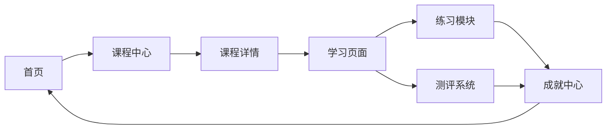

# 商务数据分析在线教育平台 - 产品需求文档

## 1. 产品概述

商务数据分析在线教育平台是专为商务数据分析与应用专业学生设计的互动式学习平台，提供完整的课程体系、学练测一体化功能和成就激励系统。

- 解决学生缺乏系统学习路径和实践机会的问题，目标用户为商务数据分析与应用专业的大中专学生
- 打造专业、易用、有趣的数据分析学习体验，提升学生的数据素养和实践能力

## 2. 核心功能

### 2.1 用户角色

| 角色 | 注册方式 | 核心权限 |
|------|---------|---------|
| 学生用户 | 邮箱/手机号注册 | 浏览课程、学习内容、完成练习、参加测评、查看成就 |

### 2.2 功能模块

1. **首页**：英雄区域、课程导航、推荐课程、成就展示
2. **课程中心**：完整课程体系、课程目录、学习进度追踪
3. **学习页面**：互动式学习内容、代码编辑器、实时反馈
4. **练习模块**：针对性练习题、即时批改、错题集
5. **测评系统**：单元测试、综合测评、成绩报告
6. **成就中心**：徽章系统、积分排行、学习记录

### 2.3 页面详情

| 页面名称 | 模块名称 | 功能描述 |
|---------|---------|---------|
| 首页 | 英雄区域 | 展示平台特色、吸引用户点击、快速导航 |
| 首页 | 课程导航 | 按主题分类展示课程、快速跳转 |
| 首页 | 推荐课程 | 展示热门课程、新课程推荐 |
| 首页 | 成就展示 | 展示最新获得的成就、激励学习 |
| 课程中心 | 课程列表 | 完整的课程体系、搜索和筛选功能 |
| 课程中心 | 课程详情 | 课程介绍、学习大纲、讲师信息 |
| 学习页面 | 学习内容 | 图文并茂的课程内容、互动演示 |
| 学习页面 | 代码练习 | 在线代码编辑器、实时运行、反馈提示 |
| 练习模块 | 题目列表 | 按知识点分类的练习题、难度标识 |
| 练习模块 | 答题界面 | 清晰的题目展示、多种题型支持 |
| 测评系统 | 考试界面 | 计时功能、题目导航、交卷确认 |
| 成就中心 | 徽章墙 | 展示所有可获得的徽章、解锁状态 |
| 成就中心 | 积分排行 | 学习积分排行榜、激励竞争 |

## 3. 核心流程

### 3.1 学习流程
学生登录平台后，浏览课程中心选择感兴趣的课程，进入学习页面学习课程内容，完成配套练习，参加单元测评，最后获得成就奖励。

### 3.2 练习与测评流程
学生在学习完课程内容后，进入练习模块完成针对性练习，系统即时批改并给出反馈；在完成单元学习后，参加测评系统的单元测试，获得成绩报告和学习建议。

### 3.3 成就获取流程
学生通过完成课程、练习和测评获得积分和徽章，在成就中心查看自己的学习记录和成就，与其他同学进行积分排行竞争。

## 4. 用户界面设计

### 4.1 设计风格
- **主色调**：深蓝色 (#1e3a8a) 和 科技蓝 (#3b82f6)，体现专业和科技感
- **辅助色**：青色 (#06b6d4) 和 橙色 (#f59e0b)，用于强调和互动元素
- **按钮风格**：圆角矩形、轻微阴影、悬浮效果
- **字体**：使用 Inter 字体族，标题使用 Bold，正文使用 Regular
- **布局风格**：卡片式布局、清晰的信息层级、充足的留白
- **图标风格**：线性图标、简洁现代、与文案配合使用

### 4.2 页面设计概述

| 页面名称 | 模块名称 | UI 元素 |
|---------|---------|---------|
| 首页 | 英雄区域 | 渐变色背景、大标题、副标题、CTA 按钮、动画效果 |
| 课程中心 | 课程卡片 | 课程缩略图、标题、简介、进度条、学习人数、评分 |
| 学习页面 | 内容区域 | 分栏布局、左侧目录导航、右侧内容展示、代码高亮 |
| 练习模块 | 答题界面 | 题目卡片、选项按钮、提交按钮、反馈提示 |
| 成就中心 | 徽章墙 | 网格布局、徽章图标、名称、描述、获得状态 |

### 4.3 响应式设计
- 采用桌面优先设计，同时适配平板和移动端
- 使用响应式网格系统，确保在各种屏幕尺寸下都有良好的显示效果
- 移动端优化触摸交互，增大可点击区域
- 确保代码编辑器在小屏幕上也能正常使用

### 4.4 交互动效
- 页面加载时的渐入动画
- 卡片悬浮时的轻微上浮和阴影加深
- 按钮点击时的缩放效果
- 成就获得时的庆祝动画
- 平滑的页面过渡和滚动效果
